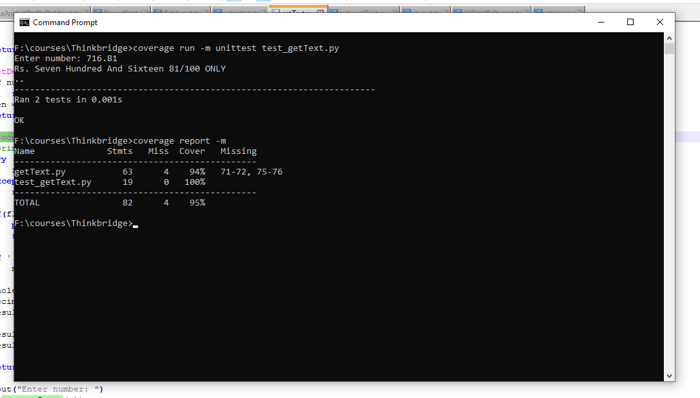

# NumbersToWords

## Running getText.py
> py getText.py

You need to have python version 3.X, preferably 3.7.7
<br>
You can download it from [here](https://www.python.org/downloads/release/python-377/).
<br>
**Output Screen**


## Running Unittest
> py -m unittest test_getText.py

**Output Screen**


## Tool for getting Code Coverage Value

**1. Install coverage.py:**
> pip install coverage

```
If above command works fine just skip the below SET command. IF it gives pip not recognized error, you need to add PIP path.
For windows, enter below SET command. For linux you can use export command to add PIP path
```
> set PATH=%PATH%;C:\Users\your_username\AppData\Local\Programs\Python\Python37\Scripts

**2. Use coverage run to run your test suite**
> coverage run -m unittest test_getText.py

**3. Use coverage report to report on the results:**
> coverage report -m

**Output Screen**



